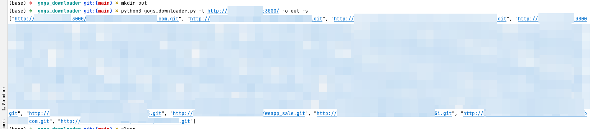

# gogs_downloader

## Possible improvements
- [ ] Multithreading (requests, git cloning)
- [ ] Clearer command line options (e.g., simple/json output, verbosity level)

## Installation

- Python3 needed
- `git clone https://github.com/SecurityDiscovery/gogs_downloader.git`
- `cd gogs_downloader`
- `python3 -m pip install -r requirements.txt`

## Usage

```commandline
usage: gogs_downloader.py [-h] -t TARGET -o OUTPUT [-s] [-v]

optional arguments:
  -h, --help            show this help message and exit
  -t TARGET, --target TARGET
                        The target. E.g. https://example.com/gogs/ or https://gogs.example.com/
  -o OUTPUT, --output OUTPUT
                        The destination directory to clone the repositories to
  -s, --s               Only show list of repos (not git clone)
  -v, --v               Verbose?
```

### Download all publicly accessible repositories
```commandline
python3 gogs_downloader.py -t http://target:3000/ -o out
```

### List all publicly accessible repositories
```commandline
python3 gogs_downloader.py -t http://target:3000/ -o out -s
```
The output directory is currently needed but won't be used with "-s".

### Screenshots




